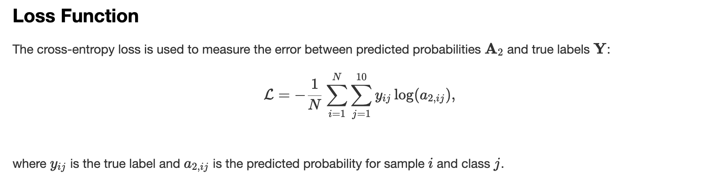

# Training a Neural Network from Scratch using C++ and Multithreading

Girish Krishnan | [LinkedIn](https://www.linkedin.com/in/girk/) | [GitHub](https://github.com/Girish-Krishnan)
___


This project is a C++ implementation of a Neural Network from scratch. The Neural Network is trained using the MNIST dataset to classify handwritten digits. The key reference for this project is Dr. Sreedath Panat's tutorial on implementing a Neural Network from scratch in Python. The tutorial can be found on YouTube [here](https://www.youtube.com/watch?v=A83BbHFoKb8). 

However, this project is implemented in **C++** and uses **multithreading** to speed up the training process. Another key challenge using C++ is implementing many of the matrix operations that are readily available in Python libraries such as NumPy, and parallelizing these operations using multithreading.

---

## Mathematical Background





---

## Implementation Details

This repository includes three implementations of a simple neural network for the MNIST dataset, each demonstrating different approaches to parallelization:

1. **`neural_network.cpp`**: A sequential implementation of the neural network.
2. **`neural_network_thread.cpp`**: A multi-threaded implementation using the C++ threading library.
3. **`neural_network_openmp.cpp`**: A parallelized implementation using OpenMP.

Each implementation trains a simple neural network with one hidden layer using gradient descent and computes the accuracy on a validation set.

---

## Command-Line Arguments

The implementations allow customization of parameters through command-line arguments. Below is the list of supported arguments:

| Argument           | Default Value       | Description                                                                 |
|--------------------|---------------------|-----------------------------------------------------------------------------|
| `--train_file`     | `data/train.csv`    | Path to the training dataset in CSV format.                                 |
| `--learning_rate`  | `0.1`               | Learning rate for gradient descent.                                         |
| `--iterations`     | `40`                | Number of iterations to train the model.                                    |
| `--train_ratio`    | `0.8`               | Ratio of the dataset to use for training. The rest is used for validation.  |
| `--hidden_size`    | `10`                | Number of neurons in the hidden layer.                                      |
| `--num_threads`    | `4` (threaded/OpenMP) | Number of threads to use (only applicable to threaded or OpenMP versions). |

---

## Compilation Instructions

To compile each implementation, use the following commands:

### Sequential Implementation
```bash
$ g++ -o neural_network neural_network.cpp -std=c++11
```

### Threaded Implementation
```bash
$ g++ -o neural_network_thread neural_network_thread.cpp -std=c++11 -pthread
```

### OpenMP Implementation
```bash
$ g++ -o neural_network_openmp neural_network_openmp.cpp -std=c++11 -fopenmp
```

Note: if you're using MacOS, you may need to install `llvm` to enable OpenMP support.

---

## Running the Programs

Each program accepts the same arguments. Below is an example of how to run the implementations:

### Example Command
```bash
$ ./neural_network --train_file ./data/train.csv --learning_rate 0.1 --iterations 100 --train_ratio 0.8 --hidden_size 10
```

For the threaded or OpenMP versions, you can also specify the number of threads:

```bash
$ ./neural_network_thread --train_file ./data/train.csv --learning_rate 0.1 --iterations 100 --train_ratio 0.8 --hidden_size 10 --num_threads 4
```

```bash
$ ./neural_network_openmp --train_file ./data/train.csv --learning_rate 0.1 --iterations 100 --train_ratio 0.8 --hidden_size 10 --num_threads 4
```

---

## Example Output

Below is an example of the output generated by running the program.

```plaintext
Iteration: 0, Training Accuracy: 0.094881, Validation Accuracy: 0.100238
Iteration: 20, Training Accuracy: 0.298512, Validation Accuracy: 0.305238
Iteration: 40, Training Accuracy: 0.42997, Validation Accuracy: 0.432976
Iteration: 60, Training Accuracy: 0.518423, Validation Accuracy: 0.520357
Iteration: 80, Training Accuracy: 0.599345, Validation Accuracy: 0.592381
Training complete!
```

The output displays the training and validation accuracy at regular intervals during the training process.

---

## License
This project is licensed under the MIT License. See the `LICENSE` file for details.

